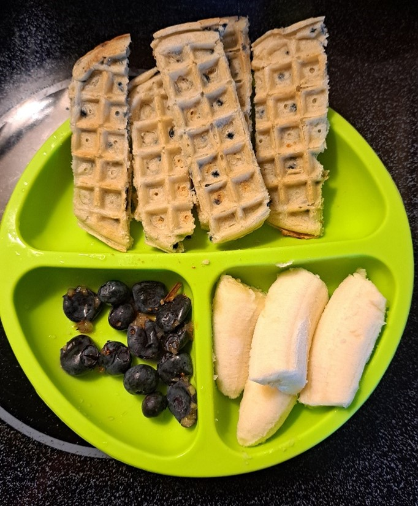
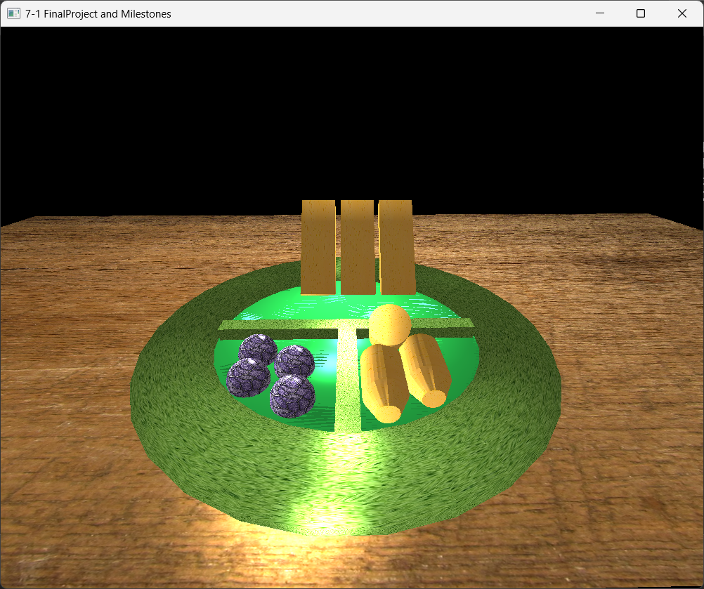

# CS-330-Graphics-and-Visualization

In this class we needed to recreate a scene from the real world and translate it into code using OpenGL in C++.

My chosen Image:

My 3D model of image:

### How do I approach designing software?
* When designing software I plan out the end design before I begin coding. Doing this will save time in the end from having to rewrite code.
  
### What new design skills has your work on the project helped you to craft?
* One Design skill that this project let me learn what how light affects a scene. Lightning can make something very creepy (low lighting) or just normal (alot of light).

### What design process did you follow for your project work?
* I had decided which onjects could be created using a single mesh or a combination of meshes. Blueberries are spheres, waffles are boxes, bananas are cylinders and tapered cylinders.
  
### How could tactics from your design approach be applied in future work?
* By planning ahead it will save time in future programs, if something is not realistic, then I will not waste time on following that train of thought.
  
### How do I approach developing programs?
* I approach developing with an incremental approach. This allows me to see progress as I am working, and make any necessary adjustments.

### How did iteration factor into your development?
* Iterating allowed me to change my strategy when placing the bananas. I was not happy with having them stacked, so after many iterations, I was able to tilt them to look like they were leaning.
  
### How can computer science help me in reaching my goals?
* Computer Science exposes me to the many different technologies that exist, and the many different ways to solve problems. Their is no one way to solve an issue.
